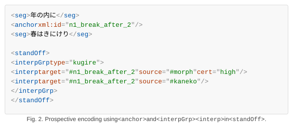
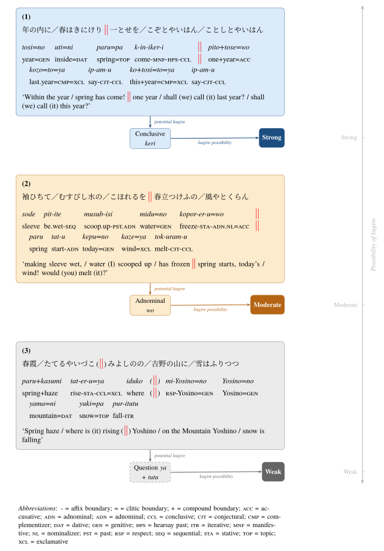

#+bibliography: references.bib
#+cite_export: csl .csl-styles/digital-scholarship-in-the-humanities.csl en-US
#+options: toc:nil
#+title: Kugire Data Curation for the Kokinwakashu TEI/XML Data
#+BEGIN_EXPORT typst
#set page(
  paper: "a4",
  width: 210mm,
  height: 297mm,
  columns: 1,
  numbering: "1"
)

#show figure: set align(center)

// Paragraph settings
#set par(
  leading: 0.8em,    // line spacing
  spacing: 1.2em,    // paragraph spacing
)

// Heading spacing
#show heading: set block(above: 3em, below: 1.5em)

// List spacing
#show list: set block(above: 1.2em, below: 1.2em)
#set list(spacing: 1.2em)

// Enumeration spacing
#show enum: set block(above: 1.2em, below: 1.2em)
#set enum(spacing: 1.2em)

// Figure and table spacing
#show figure: set block(above: 1.2em, below: 1.2em)
#set figure(placement: auto)
#show figure.caption: it => align(center, block(width: 61.8%, align(left, context {
  let label = strong(it.supplement + [ ] + it.counter.display(it.numbering) + it.separator)
  par(hanging-indent: measure(label).width, label + it.body)
})))

#align(center)[
  #set text(size: 18pt)
  Kugire Data Curation for the Kokinwakashu TEI/XML Data
]

#+END_EXPORT

* Introduction

Kugire — phrase breaks within waka poems — are well suited to studying the diversity of poetic interpretation. Translations of waka are practices of expert interpretation: they embed philological and literary knowledge into a reading of the text. Kugire is a latent structural property of every waka, and comparing where different experts locate kugire across the full anthology can serve as a measurable index of both the diversity and the stability of poetic interpretation. Analyzing such interpretive diversity in relation to poetic structure requires data.

One of the few existing kugire resources is a program[fn::https://github.com/atuko315/program-to-divide-31-syllable-Japanese-poem.] that identifies kugire with a dataset for the Hyakuninisshu, later applied to the Kokinwakashu and compared against [cite/t/c:@Asaoka2008Waka] and [cite/t/c:@Kami1985Shin]. The dataset, however, cannot capture the interpretive nature of kugire [cite/cf:see @Kami1985Shin], which admits no single correct answer. [cite/t/c:@Asaoka2007Waka] proposes two criteria — semantic independence of core sentences (necessary) and a clear grammatical break (sufficient) — both of which remain open to interpretation. Across existing resources, kugire tends to be treated as a binary property, which cannot represent the certainty of individual judgements or the range of expert readings. A kugire dataset should therefore collect annotations from multiple sources, each with documented criteria.

This project adds kugire as an interpretive annotation layer to the TEI/XML data of the Kokinwakashu, using rule-based and translation-based methods. Keeping kugire as a separate layer preserves the annotation criteria and any competing interpretations.

* Data sources

The base data is a lexically extended version of the TEI data of the Karoku second-year manuscript of the Kokinwakashu [cite/cf:@Ikuura2023Chokusen]. The extended dataset maps tokenization from the Hachidaishu Vocabulary Dataset [cite/cf:@Hodoscek2022Development] onto this segmented text, forming the basis for the kugire annotation.

For the rule-based method, we use the Hachidaishu Part-of-Speech Dataset [cite/cf:@Yamamoto2024Hachidaishu], which provides conjugation and part-of-speech data for each token. For the translation-based method, we use the explanatory translation of the Kokinwakashu by [cite/cf:@Kaneko1933Kokinwakashu], the earliest twentieth-century explanatory translation of the anthology, digitized and published on Zenodo [cite/cf:@Yamamoto2024Kokinwakashua].

* Output Data

The output is a TEI/XML file derived from the base data by appending kugire annotations to each poem. The original text, segmentation, and all existing TEI markup are preserved without modification; the annotation layer is additive.

Each kugire position is encoded as a ~<k>~ element placed after the final ~<seg>~ child of the corresponding line element ~<l>~:

#+caption: TEI/XML encoding of kugire annotations for poem 1 of the Kokinwakashu. Each ~<k>~ element marks a candidate break position. Morphological candidates carry a three-level certainty grade (~cert~: ~high~, ~mid~, ~low~); translation-based candidates (~source="kaneko"~) carry none.
#+begin_example
<l n="1" xml:id="n1">
  <seg>年の内に</seg>
  <seg>春はきにけり</seg>
  <seg>ひとゝせを</seg>
  <seg>こそとやいはむ</seg>
  <seg>ことしとやいはむ</seg>
  <k n="2" source="morph" cert="high"/>
  <k n="3" source="morph" cert="low"/>
  <k n="4" source="morph" cert="high"/>
  <k n="2" source="kaneko"/>
</l>
#+end_example

The rule-based method identifies three candidate positions. The
strongest (~cert="high"~) is after the second segment, where /keri/
appears in the conclusive form, ending the first complete sentence. A
weaker candidate (~cert="low"~) is also placed after the third
segment. The LLM-assisted translation-based method, drawing on
explanatory translation [cite/cf:@Kaneko1933Kokinwakashu], identifies
only the second segment as a kugire. The competing candidates are
preserved independently.

The =@n= attribute is the 1-based segment index; =@source= is the evidence code; =@cert= (=high= / =mid= / =low=) grades morphological certainty for rule-based annotations and is omitted for translation-based ones.

Multiple =<k>= elements at the same position represent competing interpretations — from the same source at different grammatical strengths, or from different sources — and are preserved as-is. No normalization or deduplication is applied.

The =<k>= element is a project-internal tag pending a decision on the target TEI encoding. A future revision will replace it with standard TEI mechanisms: =<anchor>= elements to mark break positions in the text, and =<interpGrp><interp>= in =<standOff>= to record the source and certainty of each annotation:

#+caption: Prospective encoding using =<anchor>= and =<interpGrp><interp>= in =<standOff>=.
#+name: fig:anchor

* Annotation pipeline

The annotation follows an LLM-assisted pipeline:

1. Rule-based suggestion of candidate kugire positions based on [cite/t/c:@Yamamoto2024Hachidaishu]
2. LLM-assisted translation-based suggestion of candidate kugire positions based on [cite/t/c:@Yamamoto2024Kokinwakashua; @Kaneko1933Kokinwakashu]
3. Review and correction in a pop-up editor showing the original poem and its reference data
4. Rendering the confirmed annotation into the TEI data

The pipeline is intended to accelerate annotation and reduce cognitive load, implemented as a reusable set of scripts designed to extend to additional translation sources.

** Rule-based (grammar-wise) kugire suggestion

Our method extends the aforementioned program, which flags conclusive forms, copulas, and sentence-final particles as kugire, by outputting graded candidates — strong, moderate, and weak — rather than a single result.

Strong candidates are phrases ending in the conclusive form. For example, in the first poem of the Kokinwakashu, the past-tense auxiliary verb /keri/ appears in the conclusive form, indicating a grammatical break after it ([[fig:example]]-(1)).

#+caption: Three types of kugire annotation derived from morphological analysis: (1) strong, (2) moderate, and (3) weak candidates. Glossing follows [cite/t/c:@Zisk2023Glossing].
#+name: fig:example
#+attr_latex: scale=100%

Moderate candidates are phrases where the copula or information structure suggests a break, though not conclusively. In the second poem of the Kokinwakashu, the segments before and after =wo= are syntactically connected, yet the former presents a scene while the latter offers a conjectural statement about it — a shift that may indicate a break ([[fig:example]]-(2)).

Weak candidates are phrases where a sentence-final particle suggests a break, but the surrounding segments remain semantically interdependent. In the third poem of the Kokinwakashu, the question particle in the second segment may suggest a break, yet the following segment answers that question — semantic interdependence that makes the break uncertain ([[fig:example]]-(3)).

** LLM-assisted translation-based kugire suggestion

We also use a large language model (LLM) to suggest candidate kugire positions from the explanatory translation of [cite/cf:@Kaneko1933Kokinwakashu] as encoded by [cite/cf:@Yamamoto2024Kokinwakashua]. Where the rule-based approach draws on morphological and grammatical features, the LLM-assisted translation-based approach draws on the contemporary Japanese translation, capturing breaks rooted in the translator's reading rather than grammatical form alone.

The LLM is =qwen2.5=, served locally via Ollama. The model receives the five segments of the original poem and the corresponding explanatory translation, and outputs a JSON object with three fields: =alignment= (step 1), =breaks= (step 2), and =positions= (the resulting candidate indices).

The prompt instructs the model to align segments to the translation, detect sentence boundaries in the translation, and map them back to segment positions — mirroring the workflow of a human annotator using a translation as reference. Three few-shot examples from real Kokinwakashu poems demonstrate this chain, covering no-kugire, second-segment, and fourth-segment cases. Valid positions from the JSON output are recorded independently of rule-based results, e.g., ~<k n="2" source="kaneko"/>~.

In practice, translation-based suggestions require frequent correction by the annotator. The tool reduces input effort but does not replace human judgement. More capable LLMs may improve suggestion quality in future work.

* Conclusion
This project produced a TEI/XML dataset prototype of kugire annotations for the Kokinwakashu, derived from a lexically extended base and informed by both rule-based and LLM-assisted translation-based methods. The dataset preserves multiple interpretations of kugire, supporting analysis of the relationship between waka structure and interpretive diversity. 

* References
#+print_bibliography:
